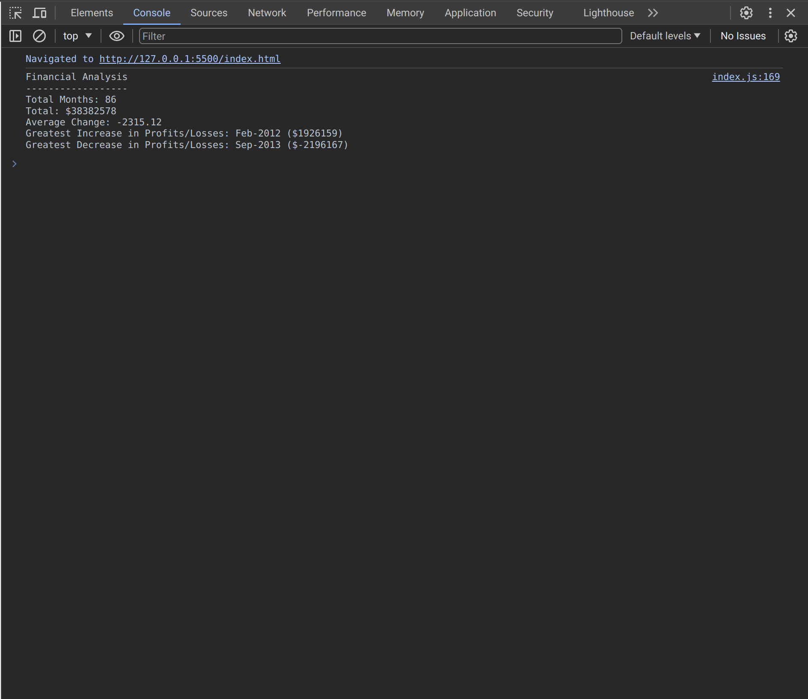

# Console Finances

This is an app that takes a dataset of profits/losses over a period of time, performs the following analysis and provides a report in the browser console:

The total number of months included in the dataset.

The net total amount of Profit/Losses over the entire period.

The average of the changes in Profit/Losses over the entire period.

The greatest increase in Profit/Losses (date and amount) over the entire period.

The greatest decrease in Profit/Losses (date and amount) over the entire period.

## Screenshot

## Webpage link

https://yrezvani.github.io/console-finances/
